## Attacker Machine Setup (Kali Linux)

Below are the step-by-step screenshots of configuring DVWA on the attacker machine:

1. **Overview of Attacker Machine**
   
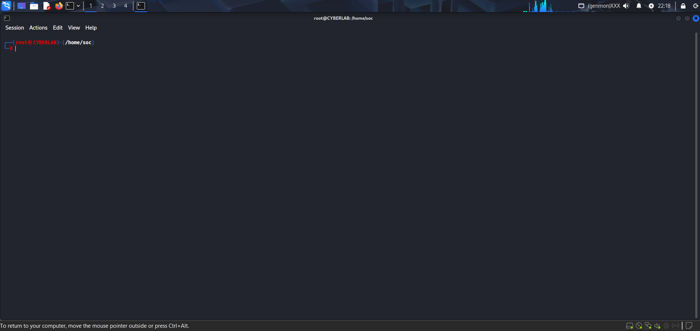

2. **Checking Apache2 Status**  

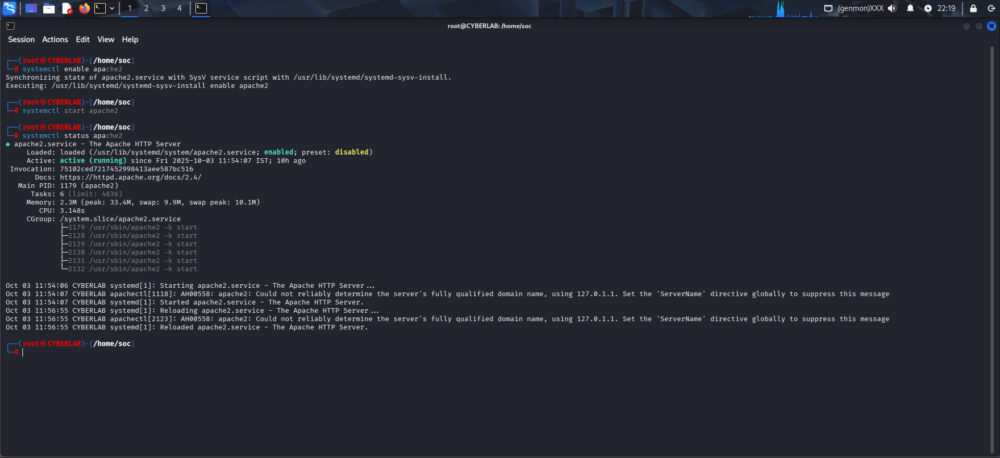

3.**Checking Database (MariaDB) Status**  

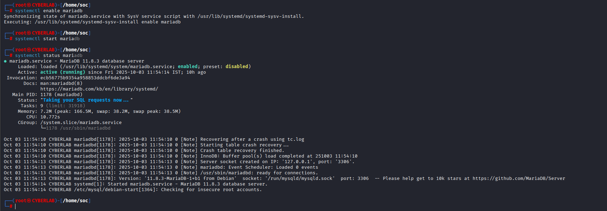

4. **Setting Up Database**  

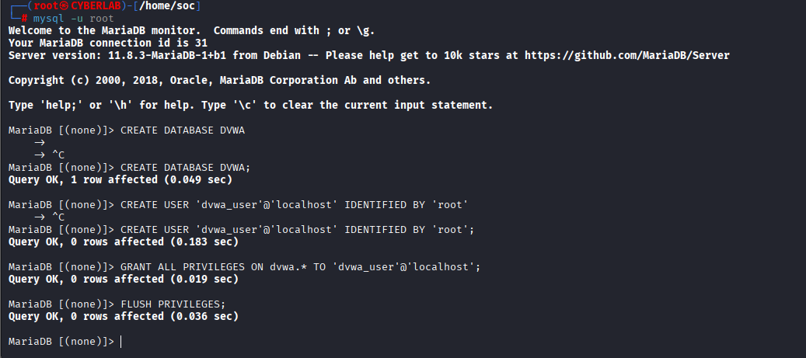

5.**Cloning the DVWA Website**  

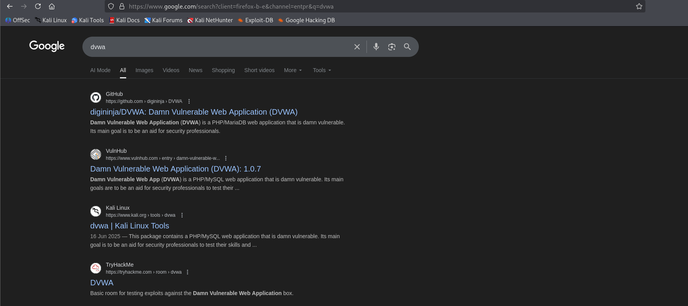

6.**Configuration File Check**  

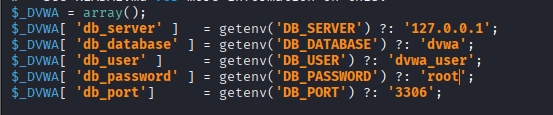

7.**DVWA Configuration and Permission Commands**  

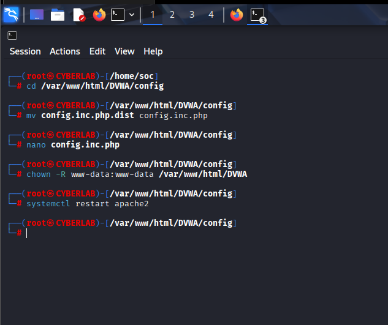

8. **DVWA Login Page**  

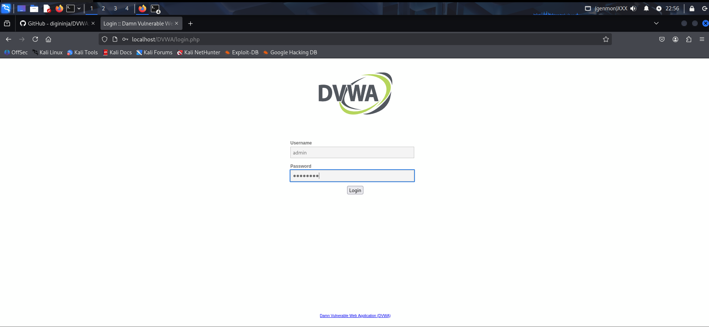

9.**DVWA Welcome Page**  

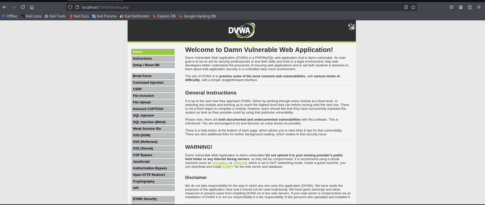

10.**Setting DVWA Security Level to Low**  

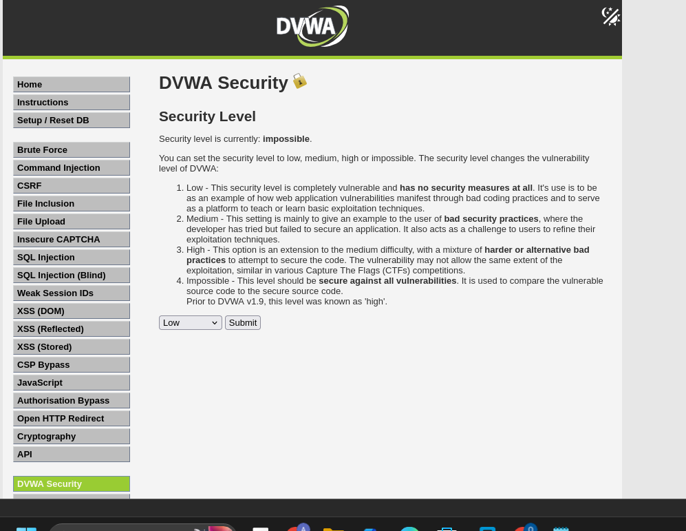

11.**Password Changed (Default → Custom)**  
_User: admin | Password: password → Custom Password_  

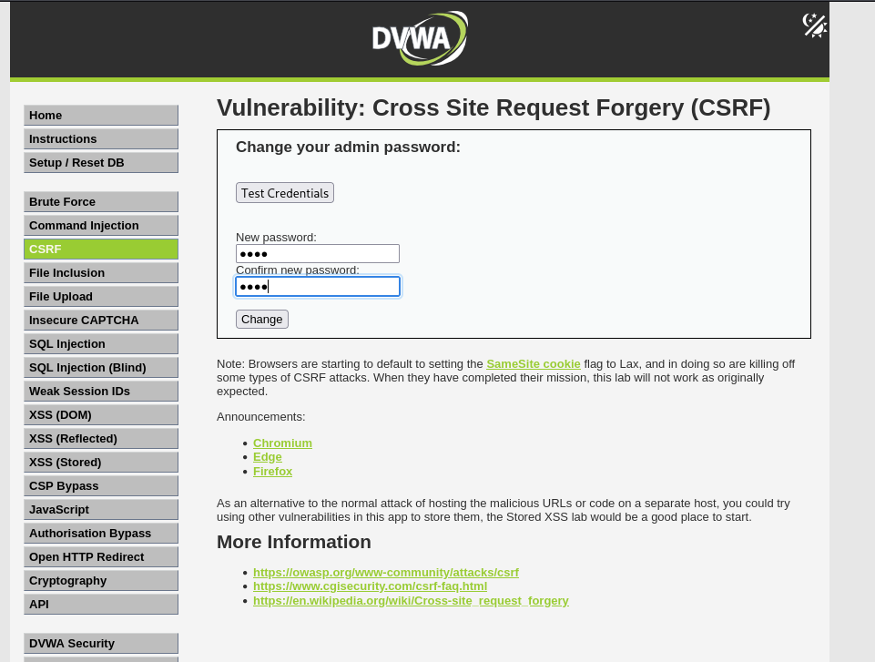

