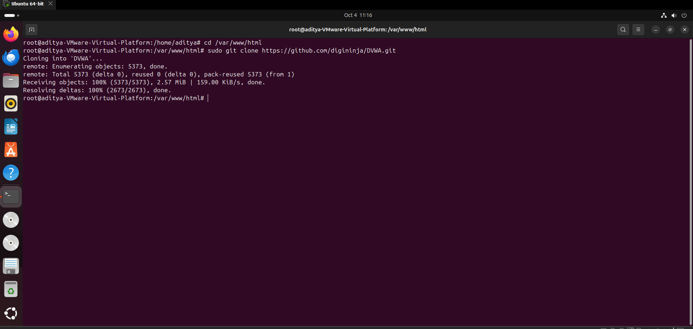
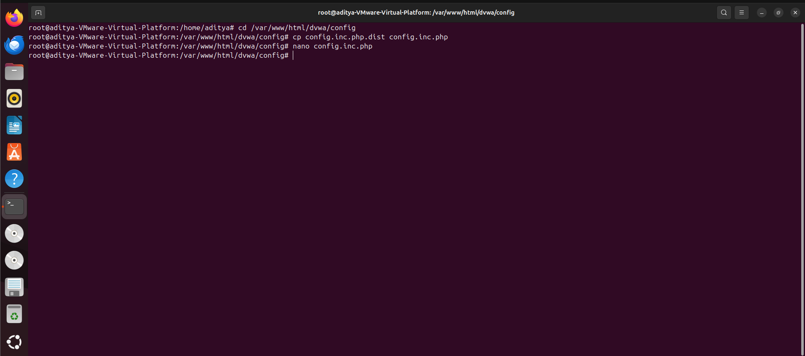
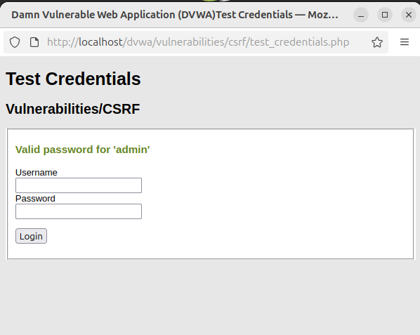

1.**Overview of Attacker Machine**

2.**Checking Apache2 Status**  

3. **Checking Database (MYSQL) Status** 

4.**Setting Up Database**  

5.**Cloning the DVWA Website**  

6.**Configuration File Check**  

7.**DVWA Configuration and Permission Commands**  

8. **DVWA Welcome Page**  

9. **Setting DVWA Security Level to Low** 

10. **Paste the link (url) copied when changing the password on attacker machine

11. **Click on the test credentials and username is admin and password -> that you set on the attacker machine

